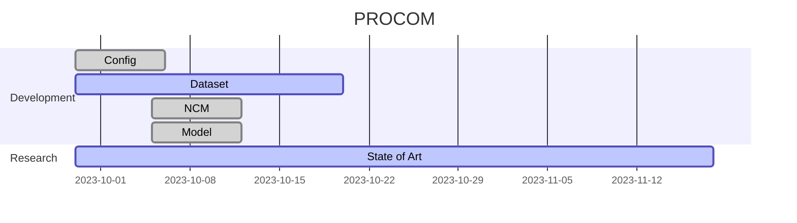
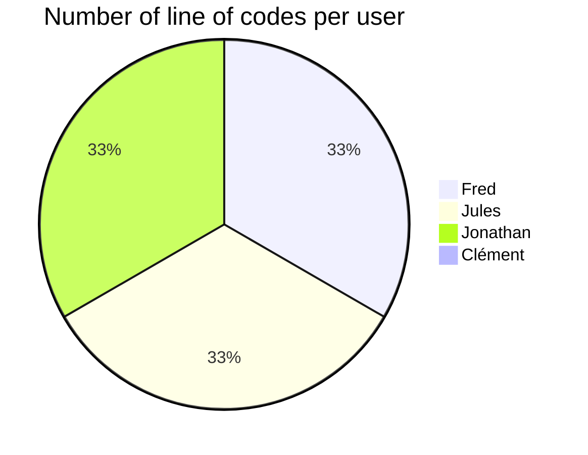

# PROCOM: Instance-wise features is all you need 🔥

## Gantt Chart 🗓️

```mermaid
gantt

dateFormat  YYYY-MM-DD
title PROCOM

section Development
Config                    :done,    des1, 2023-09-29, 7d
Dataset                   :active,  des2, 2023-09-29, 21d
NCM                       :done,    des3, 2023-10-05, 7d
Model                     :done,    des4, 2023-10-05, 7d


section Research
State of Art              :active,  des5, 2023-09-29, 50d

```

## KIKIMETER 📈
    

```mermaid
pie
title Number of line of codes per user
"Fred" : 100
"Jules" : 100
"Jonathan" : 100
"Clément" : 0
```
