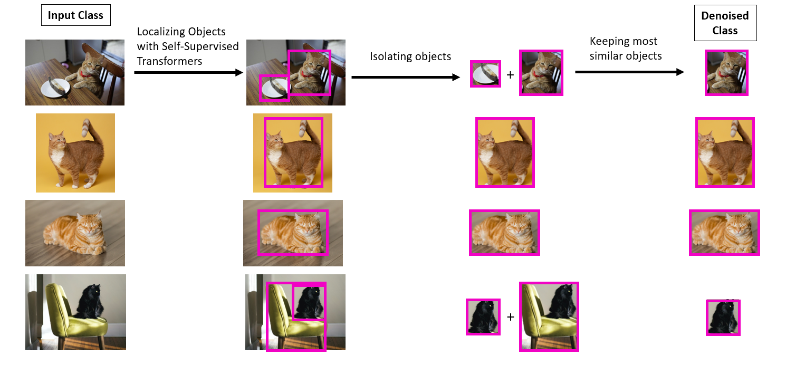
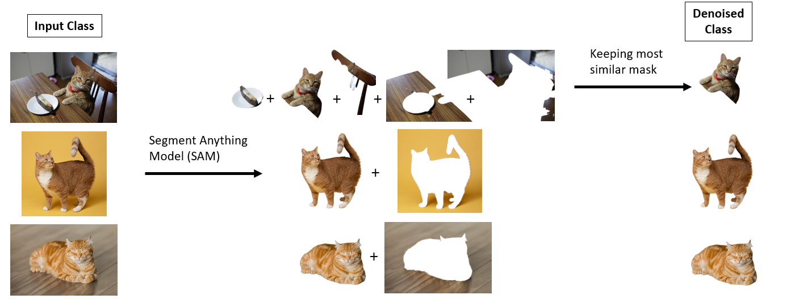
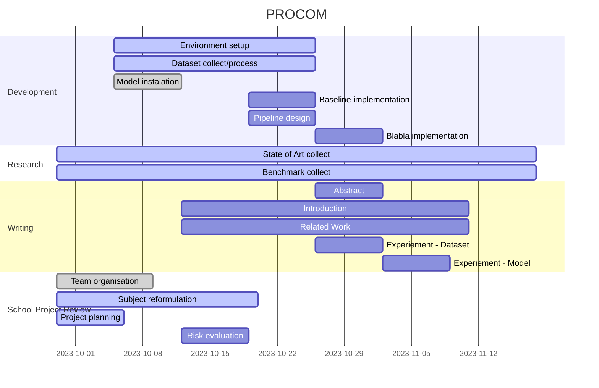
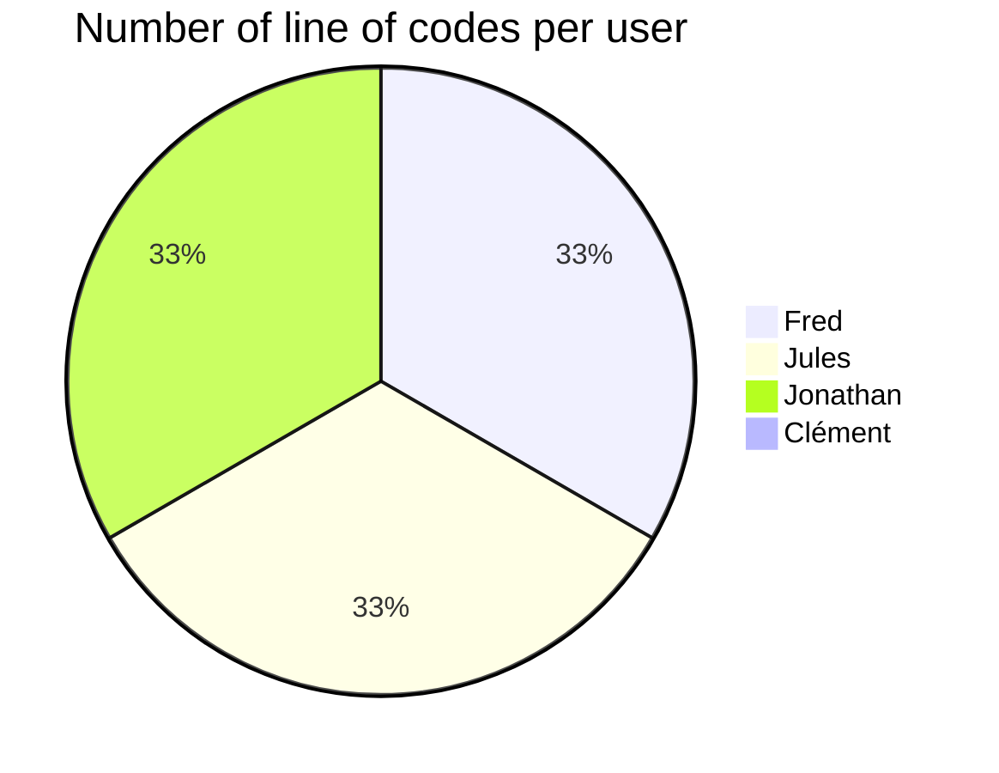

# PROCOM: Instance-wise features is all you need 🔥

## Intraduciton 

The goal of this project is to be able to disambiguate the potentially misleading images in order to improve classiffication performances. Indeed, whenever the image start to contain several objects, the classification task becomes trikiers as the model has to choose between the different objects dedected. Lets imagine an image of a cat siting next to a dog, this image can be classified either with "dog" label or "cat" label, but the model doesn't know which part refered to a cat and which refered to a dog. 

In order to remove this incertity, the goal is to remove the other objects in a training image and only focus on the part which really contain the desire object of the class. To do so, we take a batch of images belonging to the same class and use a class agnostic object detector to identify all the possible objects within an image. Then, between all the object detected in the image, we have to find the object which best represent the class. To do so, we extract features from the image, like attention mask for intance. Then a similarity method is used between those features with all the others features extracted from the other images of the batch. 

The underlying hypothesis is that the batch is big enough to contain enough images without any ambiguities to correctly describe the class. The second hypothesis is that the similarity between the features of those easy images and the corresponding objet of the multi-object image is maximal, and is discrimitative enough compared the the similarity obtain with unrelated objects. 

At the end of the process we obtain a denoised dataset which precisely decribe a class. 

### Problematic: 

### Approach : 

Two approaches have been proposed, the difference between those approach relise is the agnostic object detector. One use LOST wich directly detect objects of "interest" in a image. The other approach uses SAM wich ouputs mask of all the elements present in an images : is "segment everything". 

## Schemes of the two options 

The first approach is using [LOST](https://arxiv.org/pdf/2109.14279.pdf)

The second approach is using [SAM](https://arxiv.org/pdf/2304.02643.pdf)

## Gantt Chart 🗓️

## Instalation 

## KIKIMETER 📈

<!-- BEGIN MERMAID -->
    

<!-- END MERMAID -->
