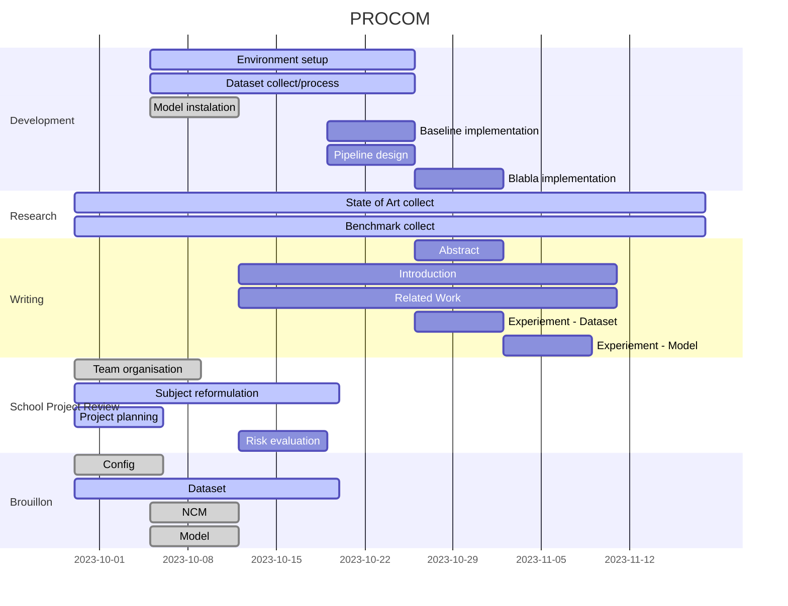
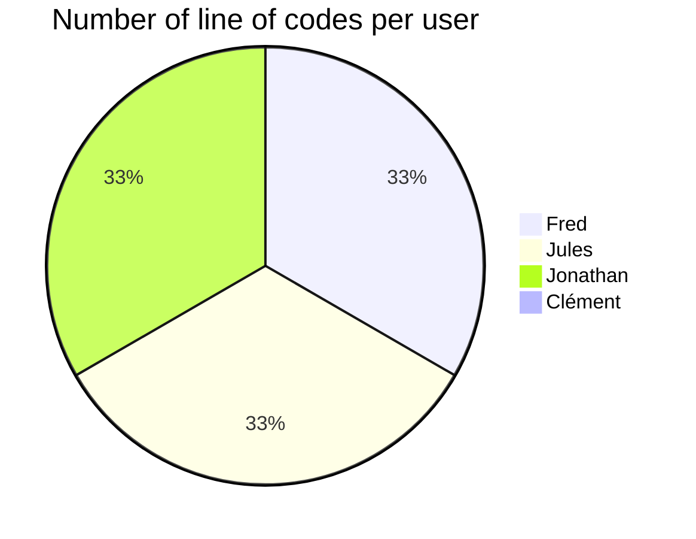

# PROCOM: Instance-wise features is all you need 🔥

## Gantt Chart 🗓️

```mermaid
gantt

dateFormat  YYYY-MM-DD
title PROCOM

section Development
Environment setup         :active,  des1, 2023-10-05, 21d
Dataset collect/process   :active,  des2, 2023-10-05, 21d
Model instalation         :done,    des3, 2023-10-05, 7d
Baseline implementation   :  des14, 2023-10-19, 7d
Pipeline design     :  des15, 2023-10-19, 7d
Blabla implementation :  des16, 2023-10-26, 7d

section Research
State of Art collect      :active,  des4, 2023-09-29, 50d
Benchmark collect         :active,  des5, 2023-09-29, 50d


section Writing 
Abstract : des17, 2023-10-26, 7d
Introduction : des18, 2023-10-12, 30d
Related Work : des19, 2023-10-12, 30d
Experiement - Dataset : des20, 2023-10-26, 7d
Experiement - Model : des21, 2023-11-02, 7d


section School Project Review
Team organisation        : done, des6, 2023-09-29, 10d        
Subject reformulation    : active, des11, 2023-09-29, 21d
Project planning         : active, des12, 2023-09-29, 7d
Risk evaluation          :        des13, 2023-10-12, 7d

section Brouillon 
Config                    :done,    des7, 2023-09-29, 7d
Dataset                   :active,  des8, 2023-09-29, 21d
NCM                       :done,    des9, 2023-10-05, 7d
Model                     :done,    des10, 2023-10-05, 7d

```

## KIKIMETER 📈

<!-- BEGIN MERMAID -->
    

```mermaid
pie
title Number of line of codes per user
"Fred" : 100
"Jules" : 100
"Jonathan" : 100
"Clément" : 0
```

<!-- END MERMAID -->
